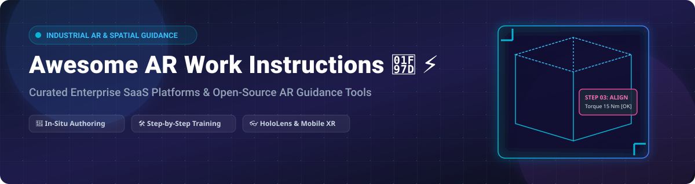

# Awesome Augmented Reality Work Instructions 🥽 ⚡

  
  
  
  
  

---

## 💡 Overview & Market Landscape 📊

**Curated List of Enterprise SaaS Platforms & Open-Source GitHub Projects for AR Work Instructions, Spatial Guidance, and Procedural Training.** 🥽🛠️

> 📈 **Market Size & Structure**: The global Augmented Reality in Manufacturing & Industrial Work Instructions market is estimated at **$2.4 Billion (2026)** and projected to grow at a **CAGR of ~31.5%**. The sector is currently **moderately fragmented**, undergoing consolidation as major enterprise software incumbents (PTC, TeamViewer, Xerox, SymphonyAI) acquire specialized AR startups, while cloud providers like Microsoft offer core platform capabilities.

These tools help frontline technicians perform complex assembly, equipment maintenance, inspection, and procedural operations with step-by-step 3D holographic guidance overlaid directly onto physical hardware.

---

## 📑 Table of Contents
- [🏢 SaaS & Enterprise Hosted Platforms](#-saas--enterprise-hosted-platforms)
- [🔓 Open-Source GitHub Projects](#-open-source-github-projects)
- [🤝 How to Contribute](#-how-to-contribute)
- [💖 Support & Sponsorship](#-support--sponsorship)
- [⚠️ Disclaimer & Lifecycle Notices](#%EF%B8%8F-disclaimer--lifecycle-notices)
- [⭐ Star History](#-star-history)

---

## 🏢 SaaS & Enterprise Hosted Platforms

| Product Name | Primary Focus / Description | Starting Price Tier | Free Tier / Trial Limit | Corporate Size & Financial Valuation |
| :--- | :--- | :--- | :--- | :--- |
| **[PTC Vuforia Expert Capture](https://www.ptc.com/en/products/vuforia/expert-capture)** | Enterprise AR work instruction creation & delivery via smart glasses/mobile. | $90 / user / month (approx. starting suite) | 14-day Enterprise Pilot Request | **Public (PTC Inc.):** ~$15.6B Market Cap (~$2.95B TTM Revenue) |
| **[TeamViewer Frontline](https://www.teamviewer.com/en/products/frontline/)** | Connected frontline worker platform for vision picking, assembly & maintenance. | $120 / user / month (approx. enterprise tier) | 14-day Free Business Trial | **Public (TeamViewer SE):** ~$1.1B Market Cap (€746.7M Revenue) |
| **[CareAR](https://www.carear.com/)** | Service experience management & step-by-step visual AR guidance. | $49 / user / month (starting tier) | 14-day Free Trial (up to 5 licenses) | **Parent Subsidiary (Xerox):** ~$7.6B Parent Revenue ($10M ServiceNow backing) |
| **[Microsoft Dynamics 365 Guides](https://learn.microsoft.com/en-us/dynamics365/mixed-reality/guides/)** | Holographic work instruction platform for HoloLens 2 (End of Support: Dec 31, 2026). | $65 / user / month | 30-day Free Trial (Requires D365 tenant) | **Public (Microsoft):** ~$3.1T Market Cap (Software Unit) |
| **[Proceedix](https://www.proceedix.com/)** | Centralized mobile & AR work instruction and digital inspection checklist platform. | $25 / user / month (starting standard tier) | 30-day Free Trial | **Acquired (SymphonyAI):** $2.2M Prior Funding (SymphonyAI Portfolio) |
| **[Scope AR WorkLink](https://www.scopear.com/)** | AR work instruction authoring & real-time 3D interactive scenario guidance. | $75 / user / month (approx. standard seat) | 14-day Free Trial | **Acquired (Flatirons Solutions):** $19.1M Prior Funding |
| **[HoloBuilder](https://www.holobuilder.com/)** | 360° reality capture & spatial AR operation instructions for construction sites. | $1,200 / project / year (starting tier) | 14-day Free Trial | **Acquired (FARO Technologies):** $34M Acquisition Price ($4M ARR) |
| **[Atheer](https://www.atheerair.com/)** | AR-powered work instructions, frontline task flow automation, and remote support. | $40 / user / month (starting seat) | 30-day Free Trial | **Private Enterprise:** ~$40.7M Total Funding ($14.6M Est. Revenue) |
| **[RE'FLEKT](https://www.reflekt.com/)** | AR procedural authoring & remote expert support ecosystem for industrial ops. | Custom Quote / Enterprise Plan | 14-day Guided Pilot | **Acquired (PTC Inc.):** Series A Funded (Acquired by PTC) |
| **[Taqtile Manifest](https://www.taqtile.com/)** | AR/MR work instruction platform supporting air-gapped on-premises deployments. | $60 / user / month (starting seat) | 14-day Guided Enterprise Trial | **Private Enterprise:** $5M Total Funding (Defense / Aerospace focus) |

---

## 🔓 Open-Source GitHub Projects

The open-source ecosystem for AR work instructions provides flexible reference architectures for researchers and custom software developers.

| Stars Badge | Repository | Description & Features | Primary Tech Stack |
| :---: | :--- | :--- | :--- |
|  | **[Microsoft SIGMA (psi)](https://github.com/microsoft/psi)** | Open-source research platform for situated interactive guidance on HoloLens 2 utilizing Detic/SEEM vision models. | C#, .NET, HoloLens 2 |
|  | **[Augmented Reality 101](https://github.com/mafda/augmented_reality_101)** | Step-by-step computer vision implementation guide for projecting 3D guidance overlays on physical objects. | Python, OpenCV |
|  | **[MirageXR (Community Edition)](https://github.com/WEKIT-ECS/MIRAGE-XR)** | Mature open-source XR training system with IEEE P1589-2020 ARLEM standard compliance, ghost tracks, and in-situ capture. | C#, Unity, ARLEM |
|  | **[TrainAR](https://github.com/jblattgerste/TrainAR)** | Open-source visual scripting framework and authoring extension for non-programmers creating handheld AR procedural training. | Unity, C#, Mobile AR |
|  | **[OEE SMED AR Analyzer](https://github.com/daribayev7/oee-smed-analyzer)** | Manufacturing changeover optimization platform incorporating step-by-step augmented reality work instruction sequences. | Python, AR Engine |
|  | **[Tuto-AR](https://github.com/erico-ke/TUTO-AR.-HackReality-Hackaton)** | Flutter-based mobile AR tutorial application featuring real-time object recognition and overlay step guidance. | Flutter, ARCore, ML Kit |

---

## 🤝 How to Contribute

Contributions are welcome! Help us expand and maintain this list:

1. 🍴 **Fork** the repository.
2. 📝 Add or update entries in `README.md` maintaining table formats and factual data.
3. 🚀 Submit a **Pull Request** with a brief summary of additions.

---

## 💖 Support & Sponsorship

If you find this repository helpful for your research, enterprise evaluation, or AR project development, please consider supporting the project! 🌟

- ⭐ **Star** this repository on GitHub to increase visibility.
- 🔄 **Share** it with fellow XR developers and industrial engineers.
- ☕ **Sponsor / Buy me a coffee**: Support ongoing curation work at [GitHub Sponsors (ishandutta2007)](https://github.com/sponsors/ishandutta2007).

Thank you for supporting open community resources! 🙏

---

## ⚠️ Disclaimer & Lifecycle Notices

- ℹ️ **Community Curated**: This repository is a community-driven resource list and does not constitute official commercial endorsement.
- ⚡ **Microsoft Dynamics 365 Guides End of Support**: Microsoft has announced end of support for Dynamics 365 Guides effective **December 31, 2026**. Subscriptions cannot be purchased or renewed past **November 1, 2025**.
- 🛠️ **Enterprise vs. Open-Source**: While open-source frameworks like MirageXR and TrainAR provide research-grade customization, commercial platforms (PTC Vuforia, TeamViewer Frontline, Taqtile) offer air-gapped security, enterprise backend integrations, and out-of-the-box hardware integration.

---

## ⭐ Star History

---

  <b>Awesome Augmented Reality Work Instructions</b> • Maintained by <a href="https://github.com/ishandutta2007">ishandutta2007</a> via <a href="https://github.com/ishandutta2007/Awesome-Awesome-Awesome">Awesome-Awesome-Awesome</a> 🚀

